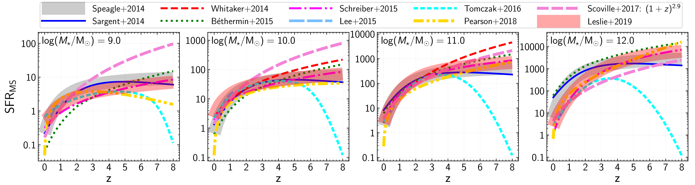
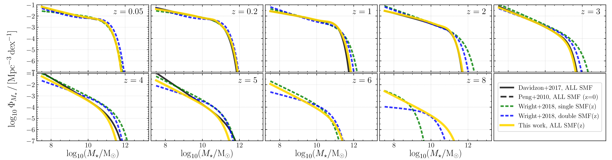
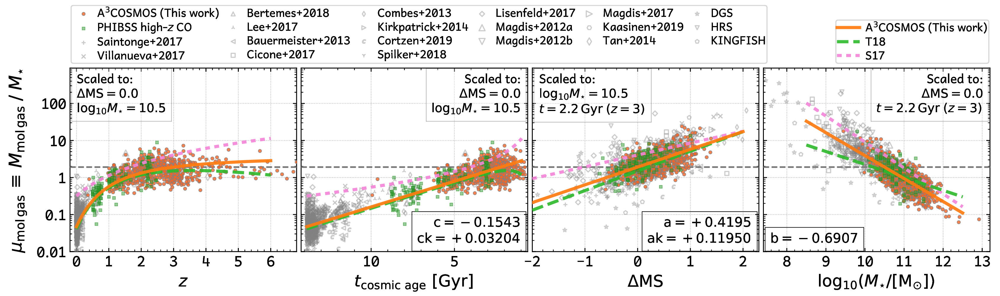
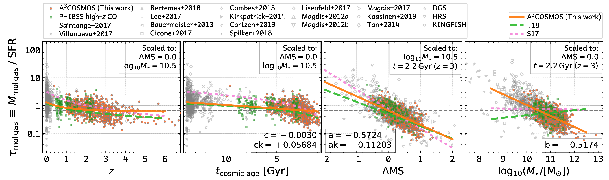

# a3cosmos-gas-evolution

This is the git repo for the Python `a3cosmos-gas-evolution` package on PyPI ([https://pypi.org/project/a3cosmos-gas-evolution/](https://pypi.org/project/a3cosmos-gas-evolution/)). 

This Python package is for scientific use in the galaxy evolution field. It aims for collecting published scaling relations and evolution functions among galaxies' gas, dust and stellar properties. 

For example, there are a number of studies on the galaxy main sequence correlations (MS), which reported functions describing how galaxies' star formation rates depend on their stellar masses and redshifts. 
There are also increasing number of works studying the cold molecular gas to baryon mass fraction or to stellar mass ratio as a function of a galaxy's stellar mass, star formation rate and redshfit. 
A compilation of these functions will facilitate many of our scientific works. 

The current `a3cosmos-gas-evolution` package (`v1.0.0`) includes:

- a number of galaxy stellar mass functions
- a number of galaxy main sequence functions
- a number of galaxy gas scaling relations
- a number of galaxy mass-metallicity relations
- a number of galaxy metallicity-dependent CO-to-H2 converstion factor ($\alpha_{\rm CO}$ functions
- a number of galaxy metallicity-dependent gas-to-dust ratio ($\delta_{\rm GDR}$) functions
- a number of galaxy size evolution functions
- a number of galaxy infrared luminosity functions
- a number of galaxy molecular gas star formation rate correlation (Star Formation Law or Kennicutt-Schmit Law or Schmidt-Kennicutt Law) functions
- a number of galaxy metallicity-dependent molecular to molecular+atomic gas mass fraction ($f_{\rm mol}$) functions
- cosmic star formation rate density evolution functions
- cosmic cold molecular gas mass density evolution functions

With limited time and energy, it is possible that some functions we collected have an issue. 
We encourage any issue finding from who are interested and/or studying galaxy evolution. 
We will try our best to keep fixing issues and adding new funcionalities. 

We hope this can be a nice public effort for helping people understanding the galaxy evolution. 

#### Known issue

##### v1.0.0

- Due to a coding bug, the output of `calc_SFR_MS_Genzel2015` should be multiplied by 1E-9. This will be fixed in v1.1.0. 

#### A few figures below

*Figure below: A few galaxy main sequence functions*

*Figure below: A few galaxy stellar mass functions (SFG+QG)*

*Figure below: A few galaxy cold molecular gas to stellar mass ratio (sometimes called gas fraction) parametrizations*

*Figure below: A few galaxy cold molecular gas depletion time parametrizations*

#### Last update

- 2021-09-16: Moving things to this git repo. Preparing this ReadMe. 

